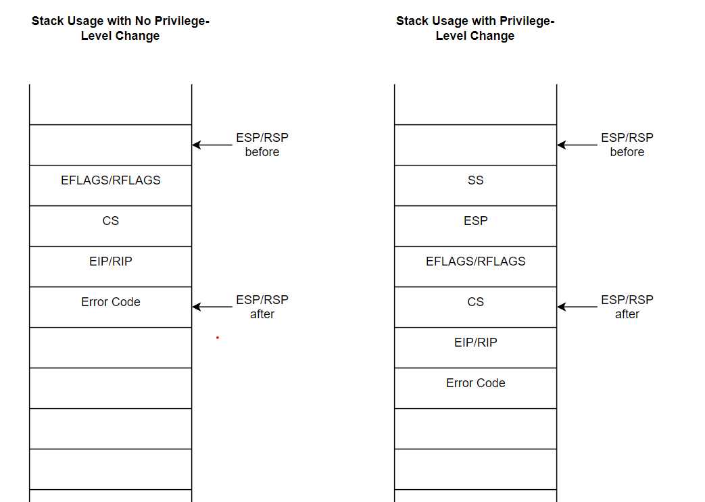

## Windows Interrupt

### Trap

Trap là cơ chế của CPU để nắm bắt thread hiện tại và chuyển flow của code hiện tại sang vị trí code khác để xử lý task quan trọng. Có 2 loại trap là
**Interrupts** và **Exceptions**. 

Những events này được xử lý bởi **Trap Handlers**.

**Interrupt**:

- Là sự kiện bất đồng bộ (Asynchronous Event)
- Interrupts là signal từ hardware devices khi mà đặc biệt cần bộ xử lý (processor) chú ý để xử lý task.
- Có 2 trạng thái là đã bật hoặc đã tắt

**Exceptions**:

- Là sự kiện đồng bộ (Synchronous event)
- Thường gây ra bởi code như chia cho 0, stack overflow, access violation
- Do chính CPU tạo ra

Khi một processor nhận được một Exception hoặc Interrupt, nó ngưng việc thực hiện task hiện tại và chuyển qua xử lý interrupt. Sau khi xử lý xong interrupt, 
task trước đó sẽ được khôi phục và thực thi tiếp.

### Saving State and Restoring the state

Giá trị của thanh ghi (registers) của các threads hiện tại sẽ được lưu trữ trước khi thực hiện xử ý interrupts và exceptions. Khi đó, CPU sẽ lưu trữ thông tin
trên kernel stack. 

**Interrupt at Ring 0**:

- EFLAGS/RFLAGS - Current processor flags
- CS - Current Code Segment
- EIP/RIP: Current program counter
- Error code: Optional

**Interrupt at Ring 3**:

- CPL (Current Privilege Level) chuyển từ Ring 3 sang ring 0 để xử lý ngắt
- Lưu SS (Stack segment) và ESP của user-mode
- Thông tin tương tự được lưu trữ trong quá trình ngắt kernel được lưu trữ.

Kernel sẽ lưu trữ tất cả các thanh ghi vào Trap Frame:

- `_KTRAP_FRAME` struct đại diện cho Trap Frame

Interrupt return (iret) là lệnh sử dụng để khôi phục các thông tin đã lưu trữ từ kernel stack.

- Chỉ có thanh ghi được lưu trữ bởi CPU được khôi phục
- Nếu interrupt xảy ra ở ring 3, CPL được chuyển từ ring 0 về ring 3

### Interrupt Internals

Interrupt Descriptor Table (IDT) là nơi CPU xác định cách xử lý các loại ngắt khấc nhau, từ ngắt phần cứng đến ngắt ngoại lệ phần mềm, cụ thể:

- IDT có 256 entries
- Mỗi entries còn được gọi là Interrupt Vector/Descriptor/Gate
- `_KIDTENTRY64` là một kernel data structure cho từng IDT entries
- CPU giải quyết IDT address bằng các sử dụng idtr register. Mỗi CPU của 1 bảng IDT riêng. CPU xác định gate (cổng) thông qua idtr + (sizeof gate * vector number).

Một trình điều khiển thiết bị (Device Driver) có thể đăng kí một Interrupt Service Routine (ISR) thông qua Interrupt Object

- Interrupt Object lưu trữ tất cả thông tin cần thiết để kernel có thể liên kết ISR với 1 hardware device cụ thể, bao gồm cả ISR address
- Interrupt Object được thể hiện bởi `_KINTERRUPT` struct trong kernel
- `KiGetInterruptObjectAddress()` - Lấy con trỏ tới Interrupt Object address